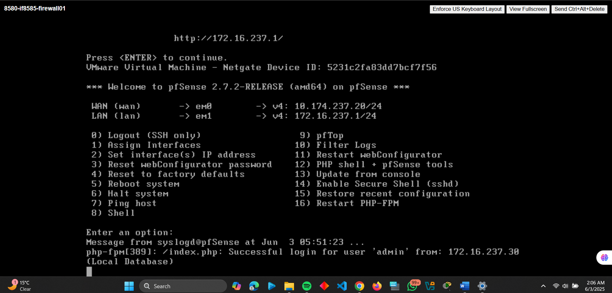
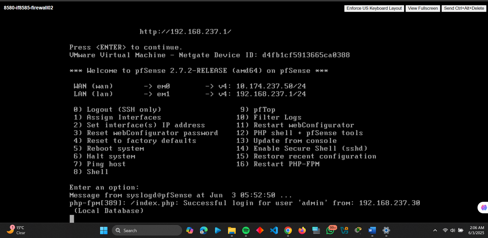
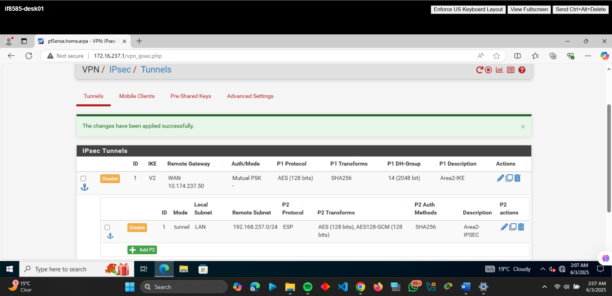
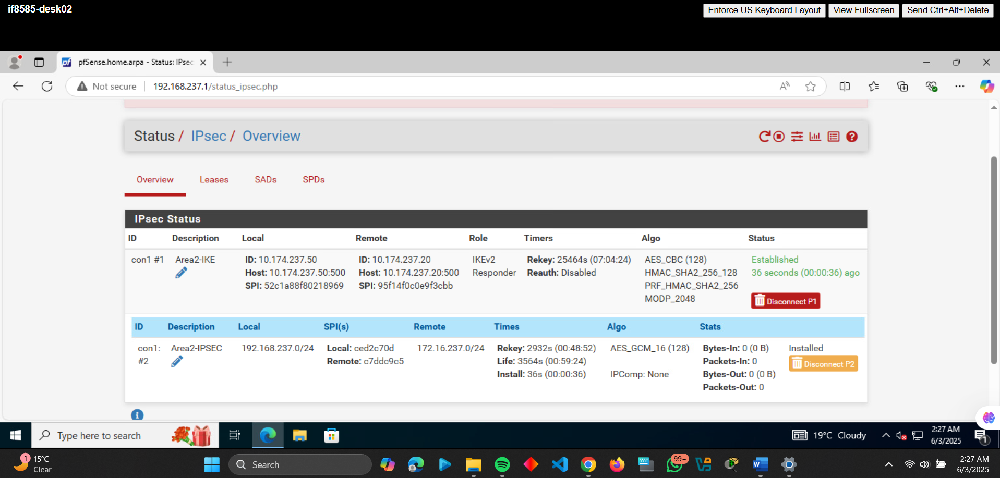
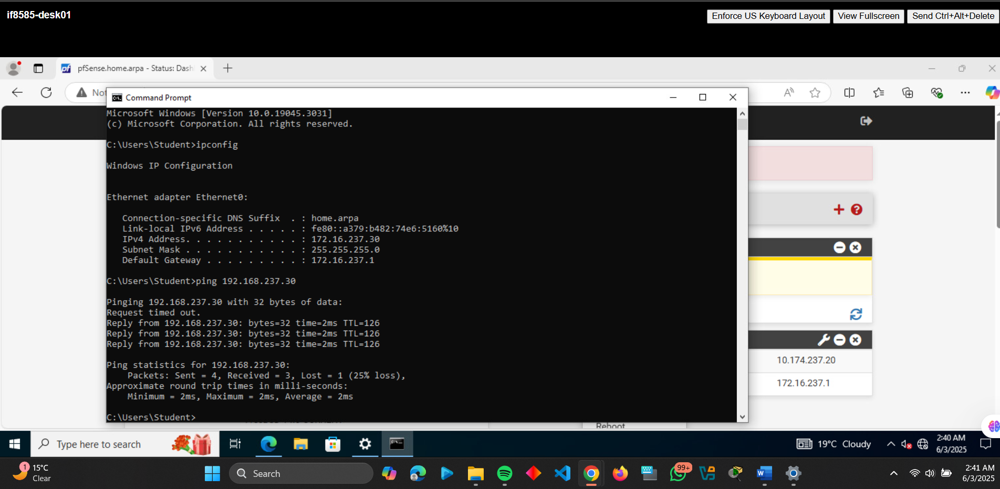
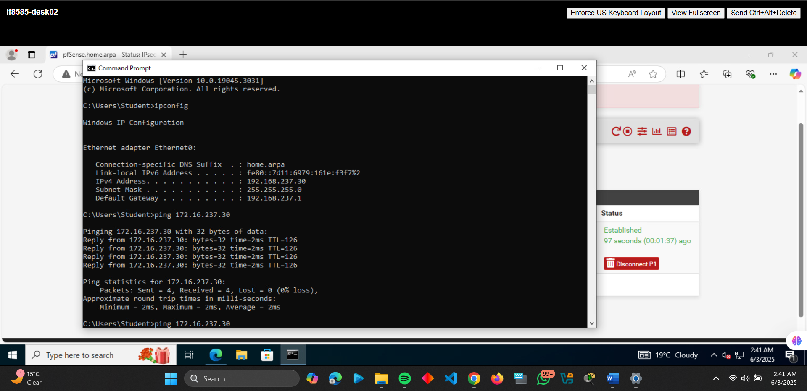

# Site-to-Site IPsec VPN Tunnel Configuration

This repository documents a hands-on project to configure a site-to-site IPsec VPN tunnel between two Windows 10 VMs using pfSense.

---

## **Project: Site-to-Site IPSEC VPN Tunnel**
### **Overview**
Securely connected two branch networks (`172.16.237.0/24` and `192.168.237.0/24`) using IKEv2 with pfSense.

### **Configuration with Screenshots**
1. **Firewall Setup**  
   - **Firewall01**:  
     - WAN: `10.174.237.20/24`  
     - LAN: `172.16.237.1/24`  
       
   - **Firewall02**:  
     - WAN: `10.174.237.50/24`  
     - LAN: `192.168.237.1/24`  
       

2. **IPSEC Tunnel Creation**  
   - Phase 1 (IKEv2): Pre-shared key authentication.  
   - Phase 2: AES-256-GCM encryption.  
     
   *Matching settings on both firewalls.*

3. **Validation**  
   - Tunnel status showing active phases:  
     
   - Cross-network ping between clients:  
     - `172.16.237.30` → `192.168.237.30`:  
       
     - `192.168.237.30` → `172.16.237.30`:  
       

### **Security Best Practices**
1. **Encryption**: AES-256-GCM for data confidentiality.  
2. **Authentication**: Certificates preferred over pre-shared keys.  
3. **Perfect Forward Secrecy**: Enabled with DH Group 14.  
4. **Lifetime Settings**: Short rekey intervals (Phase 1: 8h, Phase 2: 1h).  

---

## **How to Reproduce**
1. **Requirements**:  
   - VMware/vSphere environment.  
   - [pfSense ISO](https://www.pfsense.org/download/).  
   - Windows 10 VMs for client testing.  
2. **Steps**:  
   - Follow interface/IP assignments per project.  
   - Refer to screenshots for rule configurations.  

---
